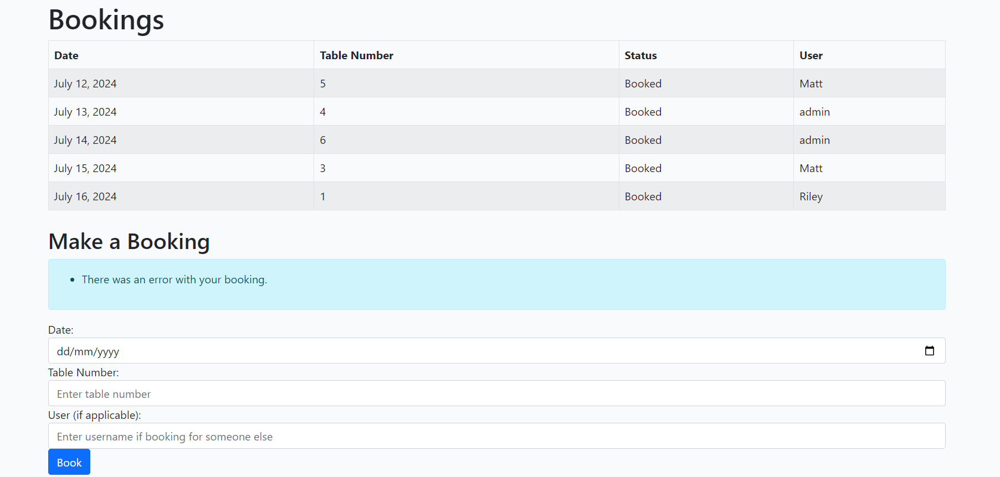
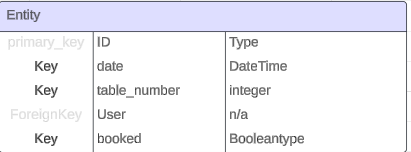

# Project 4 

## A website about restaurant booking

# Important! (to the test users/ graders only)

before you continue as you can obviously tell there is something wrong with the app names and more , please go to
the bottom of the page for my details , appologies about the inconvenience!

# features 

## The homepage 

<h2></h2>

the homepage will give you a basic display of the bookings for the site as well as whats been booked, by who and what table

## double booking

<h2></h2>

i managed to make a way to stop double bookings by reusing code from code institue and also using code i learned from
[w3schools]("https://www.w3schools.com/django/index.php")

this is capable of stopping other users from booking the same date and table and also the same user booking the same date

Note! 

the user will recieve a different error message in the same place if user is trying to book a date they themselves have already booked

## Authenticaton 

when starting the app you need an account to see whats what a small but helpful feature

## Features left to impliment

i have a list of features that could of made this website alot more unique 

giving more functionality to the 'about' page 

debugging the styles for the signup/login pages

the ability to delete and or edit bookings in the 'about' page

more styling to the main page 

align the nav bar for a more neat looking webpage 

style the footer/header to be more unique 

another page to view menu items

# Languages used 

[Python](https://www.python.org/)

[HTML5](https://en.wikipedia.org/wiki/HTML5)
 

[CSS3](https://en.wikipedia.org/wiki/Cascading_Style_Sheets)

# Diagrams, Flowcharts and ERDS

not much planning was done as i had to keep switching and overcoming problems so i had to use what i learned
and created the project 

however there is an ERD for the bookings model which is here:

<h2></h2>

# deployment

the tool used to deploy this project is heroku.

to deploy a simple heroku app, you need to setupp the enviroment to herokus needs and also to link your repository

to deploy your repository on to heroku is simple:

create/sign in to an account 

create an "app" 

link your github account to your heroku account 

search for your repository 

adjust your app_config to its needs

search for your repository 

deploy it!

# Validators 

as this project isnt properly configured i havent validated anything but ill link all the validators i would of used

the [W3C CSS validator](https://jigsaw.w3.org/css-validator/validator)

the [W3C validator](https://validator.w3.org/)

the [JSHint](https://jshint.com/)

the [PEP8](https://peps.python.org/pep-0008/)

# Testing 

sadly i couldnt make any python test files to test my applications features

# Credit 

when trying to make this i had a better understanding of what everything does by reusing code from

Code Institues walkthrough project Django
[W3Schools](https://www.w3schools.com/django/index.php)

if it werent for these two things im unsure on how would of been able to learn django a bit easier

examples of when w3schools helped me

index.html
forms.py
models.py
views.py (pretty sure this code is straight from w3schools)

# Libaries and tools used

Font Awesome [icons](https://fontawesome.com/)

[bootstrap](https://getbootstrap.com/)

[google-Fonts](https://fonts.google.com/)

the packages i installed to make this was:

whitenoise
summernote
allauth
psycopg2
gunicorn

# Important

## why is the project like this?

over the past week i has some issues creating the project as after the database went down i had to find learn how to use the substitute on top of learning django and the project ended up being unusable.

i opened up a project i was recently working on to then add and reconfigure it to be towards whats needed

## why did i do this

as a way of showing that have done some or any work was to be able to have something like this running, very bare bones but it shows what i can do and what i have learnt 

## what am i going to do next 

for the resubmission im going to go back to basics and go through the whole content on django and have a tutor help me through this as i truly thought i could do this independantly 

i want to have atleast 2 fully running apps done in the time of the resubmission 

## extra notes to grader

i appologise for what seems to be a lackluster project , theres things in this project that show potential but it also lacks content and a more authentic theme , i wanted to show that i had actually learned and taken something away from this before the deadline. 

im confident i can make a fully functioning app in django that can cover all criteria and will proceed to learn this framework! 

that is all!!!